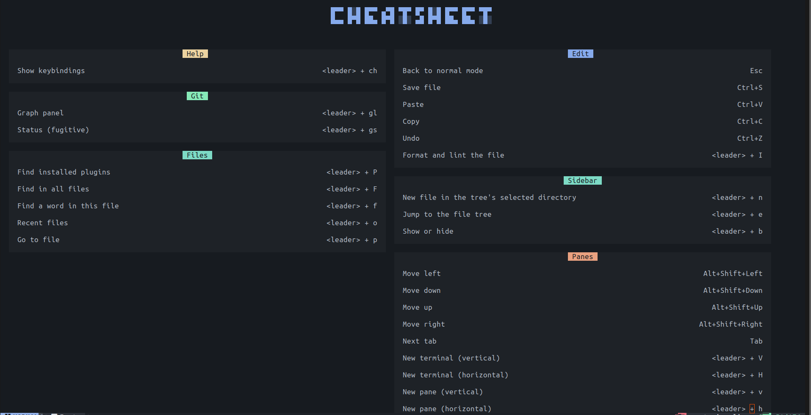

# Turning Linux Into Home

A virtual home which always makes me comfortable to code. There are different
shell scripts around here and each is responsible for installing packages and
completing a setup.

## Setup

To setup given any of the utility, simply run `./setup-<name>.sh` and if the
utility is already installed, then one can use `./setup-<name>.sh -i` to copy
paste the configuration inside `~/.config/<utility>`.

## NEOVIM

Being a strong command line-based editor, NVIM creates comfortable environment
for programming without touching your mouse.

### 1. Setup

Say, I wanna setup NEOVIM on a new device, so I would run `./setup-nvim.sh`
in terminal, sit and relax!

Each setup script takes a mode:

| Command | Utility |
| --- | --- |
| `./setup-nvim.sh` | For a new device or a broken install to full installation. |
| `./setup-nvim.sh -i` | Updates only what is missing or changed. |

### 1. Keybindings

**NOTE:** `<leader>` is `Space`.

I've choosen to not go with NvChad's keybindings and rather use the ones which
I've made being inspired from VS Code keybindings.

Use `<leader>+ch` to see complete set of keybindings.

### 2. Display

Here is how it looks so far :-)

## TERMINATOR

A terminal with the Bright Lights theme is installed under this setup. The
config and the TerminatorThemes plugin live in `terminator/`.
