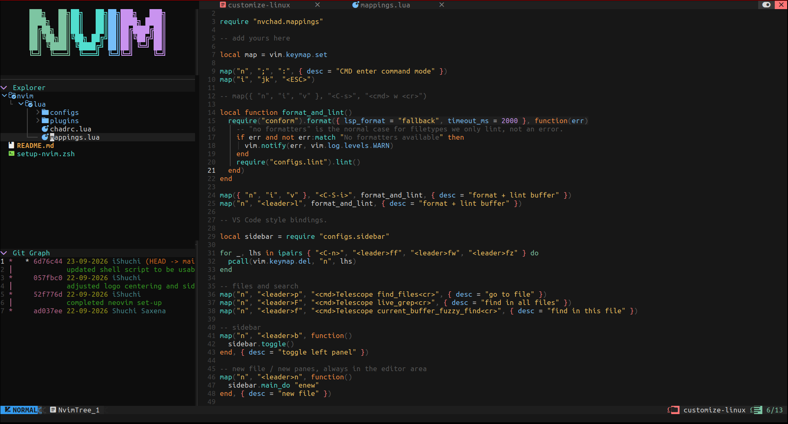

# Turning Linux Into Home

A virtual home which always makes me comfortable to code. There are different
shell scripts around here and each is responsible for installing packages and
completing a setup.

## Setup

To setup given any of the utility, simply run `./setup-<name>.sh` and if the
utility is already installed, then one can use `./setup-<name>.sh -i` to copy
paste the configuration inside `~/.config/<utility>`.

## NEOVIM

Being a strong command line-based editor, NVIM creates comfortable environment
for programming without touching your mouse.

### 1. Setup

Say, I wanna setup NEOVIM on a new device, so I would run `./setup-nvim.zsh`
in terminal, sit and relax!

Each setup script takes a mode:

| Command | Utility |
| --- | --- |
| `./setup-nvim.zsh` | For a new device or a broken install to full installation. |
| `./setup-nvim.zsh -i` | Updates only what is missing or changed. |

### 1. Keybindings

`<leader>` is `Space`. Keys marked *NvChad* are NvChad defaults kept as they are.

<table>
  <tr><th>Keys</th><th>Action</th></tr>
  <tr><th colspan="2" align="center" style="text-align: center">Files and search (fzf-lua)</th></tr>
  <tr><td><code>&lt;leader&gt;p</code></td><td>Find a file</td></tr>
  <tr><td><code>&lt;leader&gt;o</code></td><td>Recent files</td></tr>
  <tr><td><code>&lt;leader&gt;f</code></td><td>Find a word in this file</td></tr>
  <tr><td><code>&lt;leader&gt;F</code></td><td>Find a word in all files</td></tr>
  <tr><td><code>&lt;leader&gt;P</code></td><td>Find installed plugins (<code>Enter</code> searches inside one)</td></tr>
  <tr><th colspan="2" align="center" style="text-align: center">Editing</th></tr>
  <tr><td><code>&lt;leader&gt;I</code></td><td>Format and lint the file</td></tr>
  <tr><td><code>Ctrl+c</code></td><td>Copy selection, or the current line</td></tr>
  <tr><td><code>Ctrl+v</code></td><td>Paste (visual block moves to <code>Ctrl+q</code>)</td></tr>
  <tr><td><code>Ctrl+s</code></td><td>Save <em>NvChad</em></td></tr>
  <tr><td><code>Esc</code></td><td>Back to normal mode (<code>Esc</code> works in the terminal too)</td></tr>
  <tr><th colspan="2" align="center" style="text-align: center">Switching Between Panes</th></tr>
  <tr><td><code>Tab</code></td><td>Next</td></tr>
  <tr><td><code>&lt;leader&gt;x</code></td><td>Close tab <em>NvChad</em></td></tr>
  <tr><td><code>&lt;leader&gt;h</code> / <code>&lt;leader&gt;v</code></td><td>Split editor horizontally/vertically</td></tr>
  <tr><td><code>&lt;leader&gt;H</code> / <code>&lt;leader&gt;V</code></td><td>New terminal, horizontal/vertical</td></tr>
  <tr><td><code>Alt+Shift+Arrow</code></td><td>Move between editor and terminal panes</code></td></tr>
  <tr><th colspan="2" align="center" style="text-align: center">Sidebar</th></tr>
  <tr><td><code>&lt;leader&gt;b</code></td><td>Show or hide the sidebar</td></tr>
  <tr><td><code>&lt;leader&gt;e</code></td><td>Jump to the file tree <em>NvChad</em></td></tr>
  <tr><td><code>&lt;leader&gt;n</code></td><td>New file in the directory selected in the tree</td></tr>
  <tr><td><code>&lt;leader&gt;gs</code></td><td>Git status (fugitive)</td></tr>
  <tr><td><code>&lt;leader&gt;gl</code></td><td>Git graph panel</td></tr>
  <tr><td><code>Shift+Left</code> / <code>Shift+Right</code></td><td>Scroll the git graph sideways</td></tr>
</table>

### 2. Display

Here is how it looks so far :-)

## TERMINATOR

A terminal with the Bright Lights theme is installed under this setup. The
config and the TerminatorThemes plugin live in `terminator/`.
